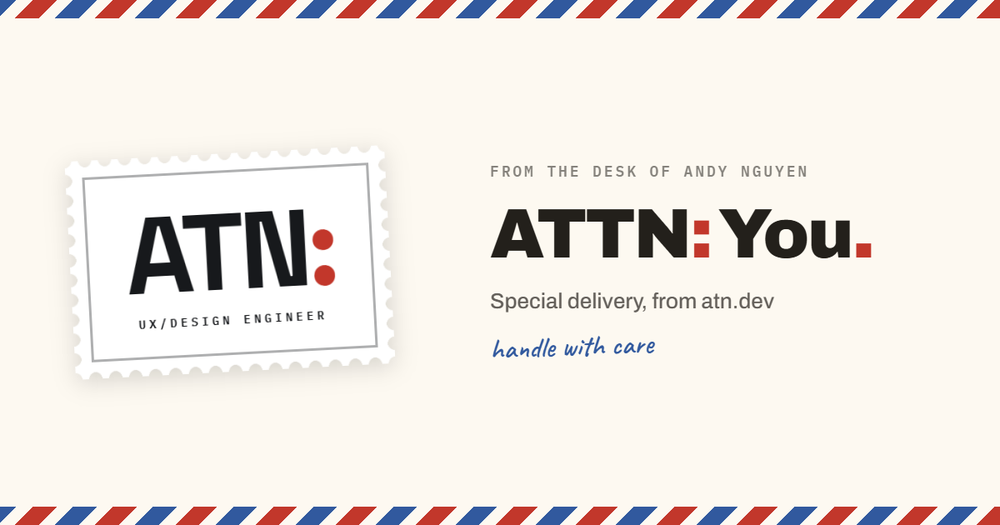
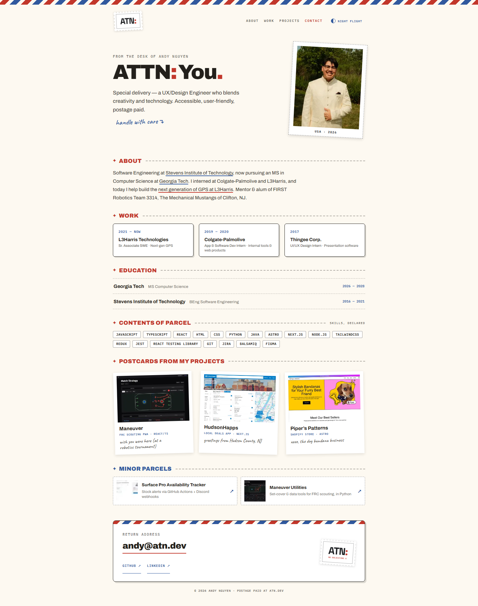
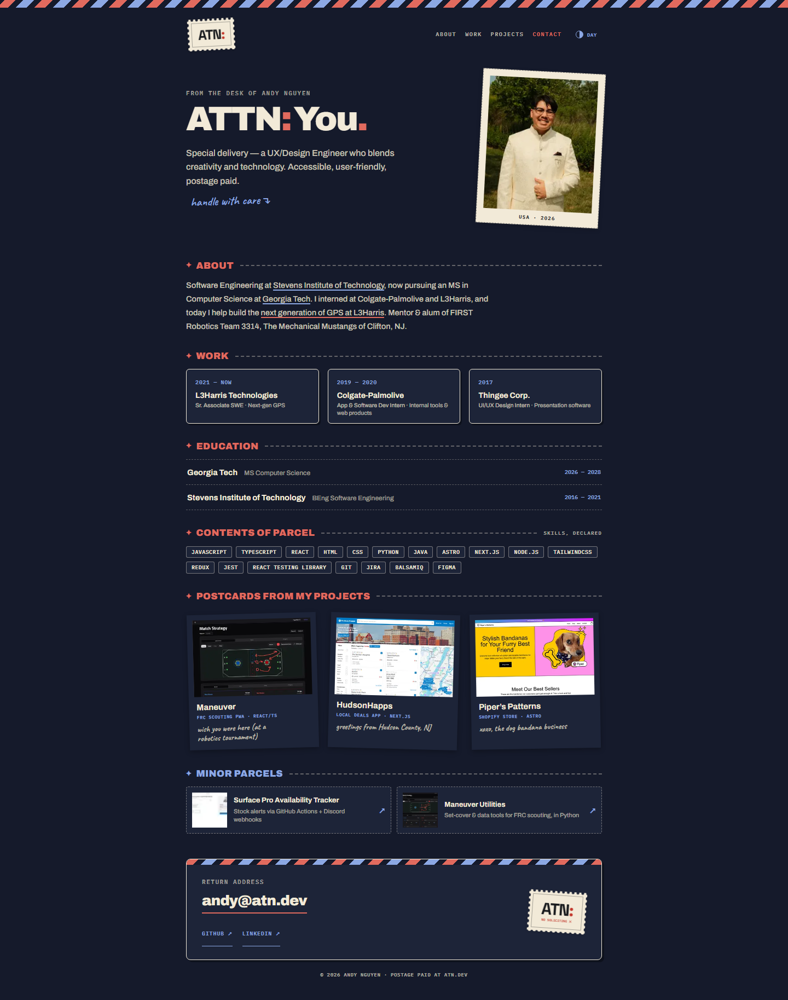
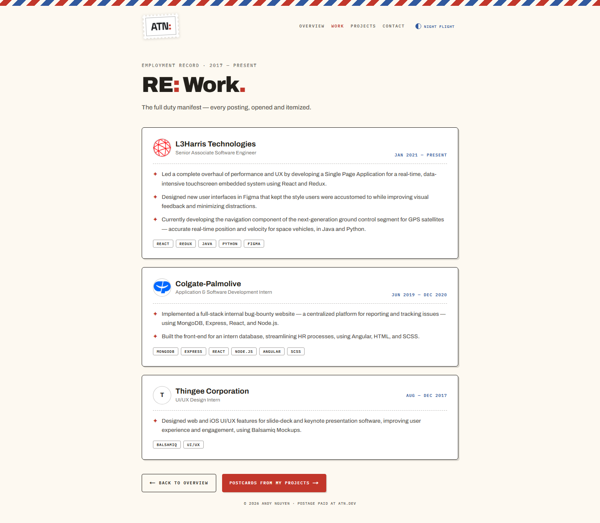
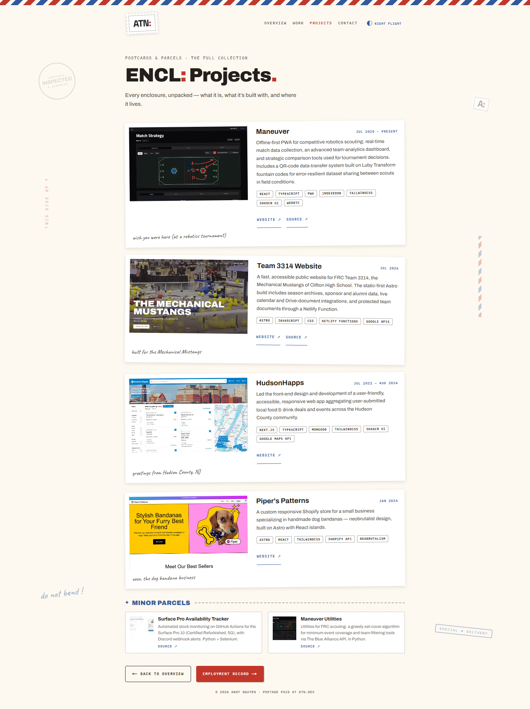

# ATN — Air Mail Portfolio



The source for [atn.dev](https://atn.dev), Andy Nguyen’s personal portfolio.
The design treats `ATN` as the attention line on a piece of air mail, with
postage-stamp branding, postcard projects, customs-declaration skills, an
envelope contact card, and a “Return to Sender” 404 page.

## Features

- Responsive multi-page portfolio with Overview, Work, Projects, and Maneuver case-study routes
- Shared navigation with active-page state and a return-address contact anchor
- Day and persistent “Night Flight” themes
- Custom branded 404 experience
- Static, typed portfolio content in `src/data/portfolio.ts`
- Optimized project imagery, favicon, and social sharing metadata
- Playwright interaction, responsive-layout, and accessibility coverage

## Screenshots

| Day Flight | Night Flight |
| --- | --- |
|  |  |

| Employment record | Project collection |
| --- | --- |
|  |  |

## Development

Node.js 20.9 or newer and pnpm are required.

```bash
pnpm install
pnpm dev
```

Open [http://localhost:3000](http://localhost:3000).

Before opening a pull request, run:

```bash
pnpm lint
pnpm typecheck
pnpm build
pnpm test:e2e
```

Install Playwright’s Chromium runtime once when needed:

```bash
pnpm exec playwright install chromium
```

## Architecture

- Next.js 16 App Router and React 19
- Static routes at `/`, `/work`, `/projects`, and `/projects/maneuver`, plus the branded 404
- Tailwind CSS 3 with a purpose-built Air Mail component layer
- `next-themes` for the device-local theme preference
- `next/font` for Archivo, IBM Plex Mono, Caveat, and Space Grotesk
- Playwright and axe-core for browser-level quality checks

## History and license

An earlier version of this repository began from
[Dillion Verma’s portfolio template](https://github.com/dillionverma/portfolio).
The current Air Mail visual identity, content design, and implementation are by
Andy Nguyen. The original MIT copyright notice is preserved alongside the
copyright for the new work in [LICENSE](LICENSE).
